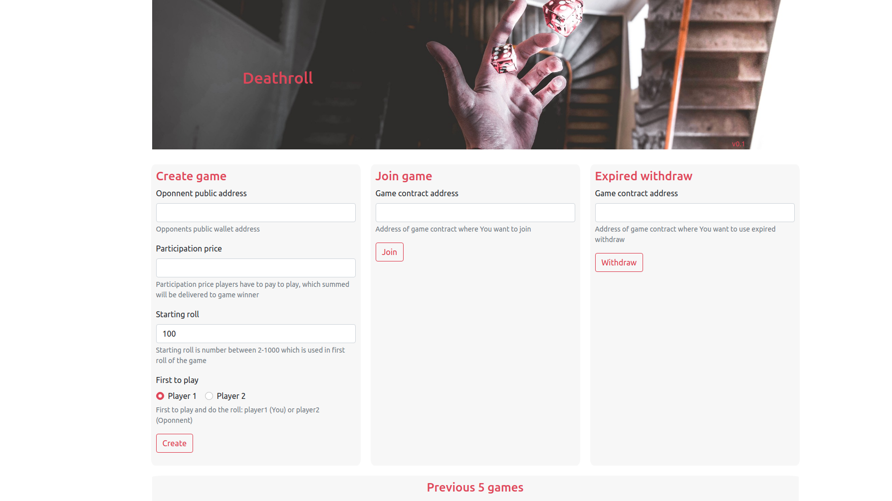
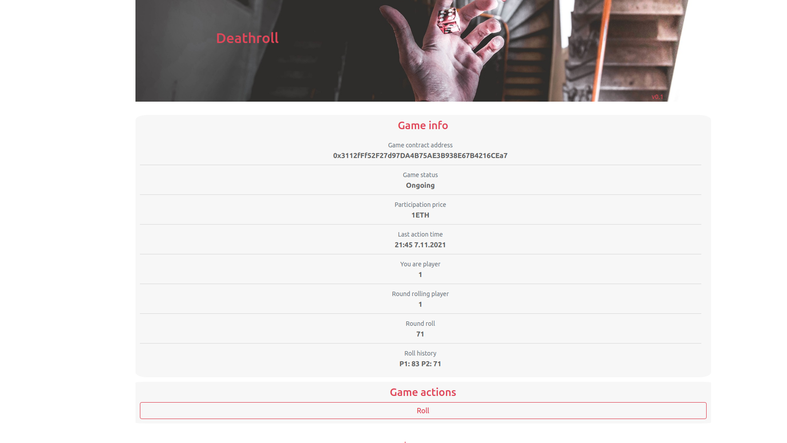
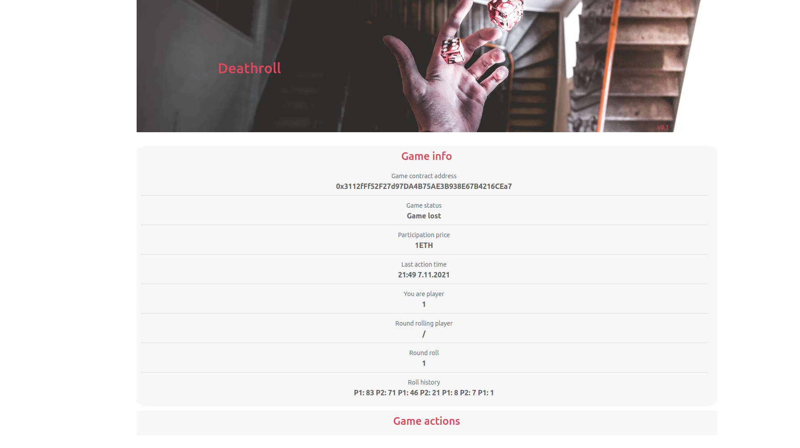

## Deathroll-dapp
Decentralized react web app, Solidity smart contracts on Ethereum Blockchain for famous gambling functionality of Deathrolling.

<hr/>

### Rules of play
Game for two players where each person takes it in turns rolling random numbers. Each next rolls maximum number is previously rolled number. First to get to 1. loses game and pays out.

<hr/>

### How to build and start project
Project can be start by simply pulling an starting docker image or from source

#### Starting project from docker
* Pull docker image from registry
``` bash
docker pull ghcr.io/mrlaki5/deathroll-dapp:latest

# Note: there is option to build image localy (first project must be build from sources):
# cd docker & docker build -t deathroll ghcr.io/mrlaki5/deathroll-dapp:latest -f dockerfile .
```

* Start container with server inside
``` bash
docker run -p 80:80 --name deathroll ghcr.io/mrlaki5/deathroll-dapp:latest
```

#### Starting project from sources
* Compile smart-contract from smart-contracts/Deathroll.sol with Solidity compiler and place json output that contains abi and binary under web-client/src/contracts/Deathroll.json

* Inside web-client install dependencies. Note: this needs to be done only once
``` bash
npm install
```

* Start web-client react app.
``` bash
npm start
```

<hr/>

### How to play
* #### Player1 needs to create game (contract) with filling in public wallet address of player2 and additional game information.
* #### After game creation, player1 needs to send game contract address to player2, so player2 can join game with it.


* #### After they both join and go through init phase, they will start rolling and validating rolls until one player rolls 1 and losses the game.


* #### Other player will be able to take price afterwards.

