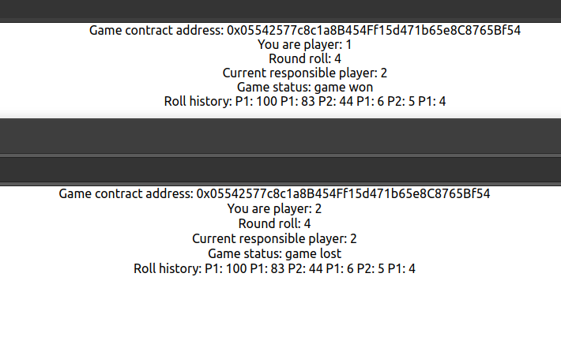

## Deathroll-dapp
Decentralized react web app, Solidity smart contracts on Ethereum Blockchain for famous gambling functionality of Deathrolling.

### Rules of play
Game for two players where each person takes it in turns rolling random numbers. Each next rolls maximum number is previously rolled number. First to get to 1. loses game and pays out.

### How to build and start project
* Compile smart-contract from smart-contracts/Deathroll.sol with Solidity compiler and place json output that contains abi and binary under web-client/src/contracts/Deathroll.json

* Inside web-client install dependencies. Note: this needs to be done only once
``` bash
npm install
```

* Start web-client react app.
``` bash
npm start
```

### Docker build
``` bash
cd docker
docker build -t deathroll ghcr.io/mrlaki5/deathroll-dapp:latest -f dockerfile .
docker run -it --rm -p 80:80 --name deathroll ghcr.io/mrlaki5/deathroll-dapp:latest
```

### How to play
* Player1 needs to create game (contract) with filling in public wallet address of player2.

* After game creation, player1 needs to send game contract address to player2, so player2 can join game with it.

* After they both join and go through init phase, they will start rolling and validating rolls until one player rolls 1 and losses the game.


